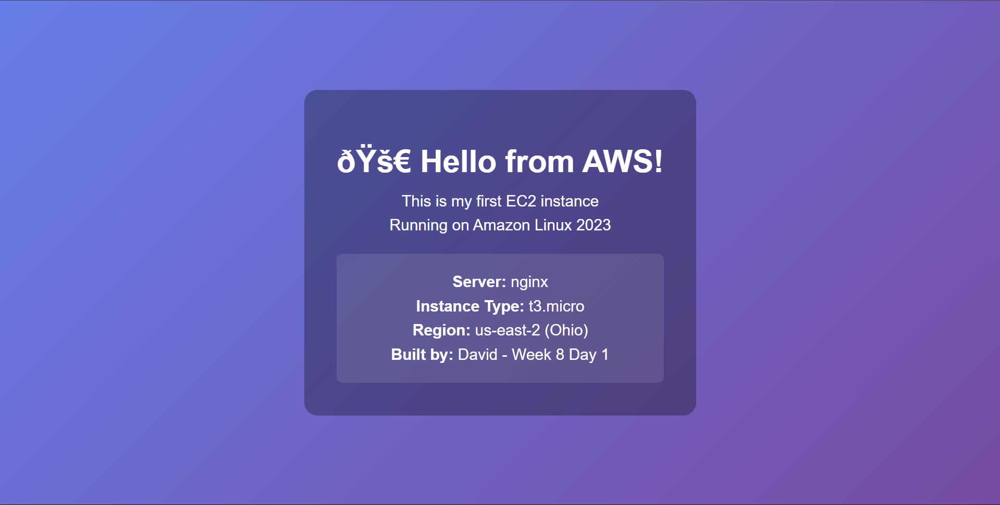

# Week 8 Day 1: My First EC2 Instance

## What I Built
- EC2 Instance: my-first-web-server
- Instance Type: t3.micro (2 vCPU, 1 GiB RAM)
- AMI: Amazon Linux 2023
- Region: us-east-2 (Ohio)
- Public IP: 18.222.0.223

## Security Group Configuration
Name: web-server-sg

**Inbound Rules:**
- SSH (port 22): From my IP only
- HTTP (port 80): From anywhere (0.0.0.0/0)

**Why these rules:**
- SSH restricted to my IP: Security - only I can administrate the server
- HTTP open to world: Necessary - anyone should be able to visit the website

## Steps I Followed
1. Launched EC2 instance via AWS Console
2. Created SSH key pair (my-ec2-key.pem)
3. Connected via SSH: `ssh -i key.pem ec2-user@IP`
4. Updated system: `sudo dnf update -y`
5. Installed nginx: `sudo dnf install nginx -y`
6. Started nginx: `sudo systemctl start nginx`
7. Created custom HTML page
8. Website live at: http://18.222.0.223

## Key Learnings

**What is EC2:**
- Elastic Compute Cloud = virtual servers in AWS
- Launch in seconds, pay by the hour
- Scale up/down as needed

**Instance Types:**
- t3.micro = General purpose, burstable, free tier
- Format: Family + Generation + Size

**Security Groups:**
- Act as firewall for EC2 instances
- Stateful (if you allow inbound, outbound response is automatic)
- Can be changed anytime without restarting instance

**SSH Key Pairs:**
- Public key on EC2 instance
- Private key on my machine
- Required permissions: chmod 400
- Never lose the private key - it's your only access

**AMI (Amazon Machine Image):**
- Pre-configured OS template
- Amazon Linux 2023 = optimized for AWS, based on RHEL
- Default user: ec2-user

## Commands I Used
```bash
# Connect to instance
ssh -i ~/.ssh/aws-keys/my-ec2-key.pem ec2-user@18.222.0.223

# Update system
sudo dnf update -y

# Install nginx
sudo dnf install nginx -y

# Start and enable nginx
sudo systemctl start nginx
sudo systemctl enable nginx

# Check nginx status
sudo systemctl status nginx

# View nginx process
ps aux | grep nginx

# Check open ports
sudo ss -tulpn
```

## Questions I Can Answer

**1. What's the difference between public IP and private IP?**
- Public IP: Used to access instance from internet (18.222.0.223)
- Private IP: Used within AWS VPC for internal communication (172.31.x.x)
- Public IP changes if instance stopped/started (unless Elastic IP)

**2. Why chmod 400 on SSH key?**
- SSH requires private key to be read-only for owner
- 400 = owner read-only, no access for group/others
- Security: prevents key theft if someone accesses your computer

**3. What happens if I change security group after instance is running?**
- Changes take effect immediately, no restart needed
- This is a key advantage of cloud - dynamic configuration

**4. What's the difference between stopping and terminating?**
- Stop: Instance paused, can restart later, EBS volume preserved, no compute charges
- Terminate: Instance deleted forever, EBS can be deleted or kept (depending on setting)

## Cost Awareness

**Free Tier Limits:**
- 750 hours/month of t2.micro or t3.micro
- = 1 instance running 24/7 OR 2 instances 12h/day each

**My usage:**
- 1 instance running
- As long as I don't exceed 750 hours/month = FREE
- If I forget and leave it running past month end = ~$7.50/month

**Always terminate instances when done learning!**

## Next Steps
- Tomorrow: Learn about EBS volumes and snapshots
- Attach IAM role to this instance for S3 access
- Set up CloudWatch monitoring
- Learn about Auto Scaling

## Website Screenshot

